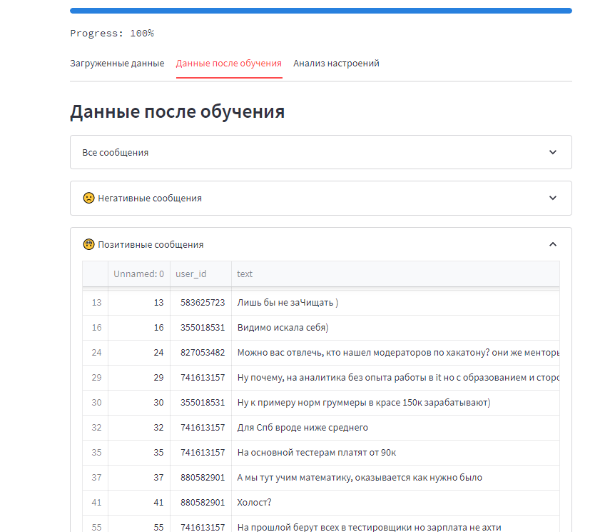
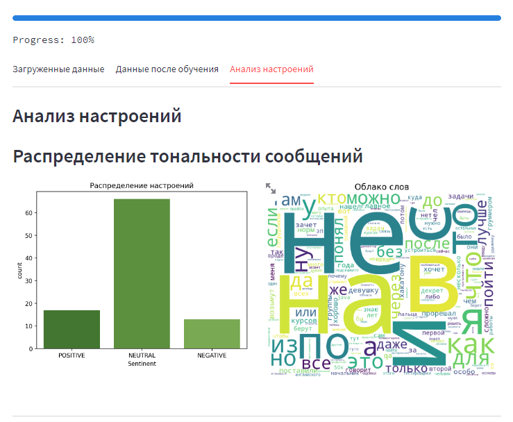

# Web-приложение для определения тональности чата Телеграм

## Парсинг Телеграмм

[Ссылка на код парсинга Телеграм](https://github.com/smirnovaanastasia1234/Te/blob/main/pars_teleg.py )

Web-приложение для определения тональности текста. Используются библиотеки:

- [TensorFlow](https://www.tensorflow.org/).
- [Streamlit](https://streamlit.io/).

Для распознавания текста используется модель DeepPavlov/rubert-base-case-conversational (https://huggingface.co/DeepPavlov/rubert-base-cased-conversational/)

- ["sentiment-analysis","blanchefort/rubert-base-cased-sentiment"](https://huggingface.co/DeepPavlov/rubert-base-cased-conversational/).

## Streamlit app

Приложение можно найти , щелкнув по значку Streamlit

## Результаты работы приложения
Несколько примеров работы приложения:
*пользователь приложения может отдельно посмотреть негативные, позитивные и нейтральные сообщения:

*в приложении представлен визуальный анализ сообщений: 

## Использованная литература
* [Ссылка на документацию streamlit](https://docs.streamlit.io/)
* [Ссылка на документацию huggingface](https://huggingface.co/blanchefort/rubert-base-cased-sentiment)
